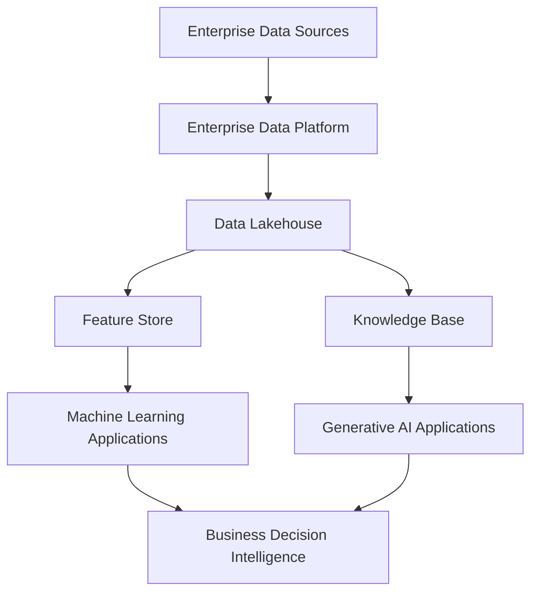
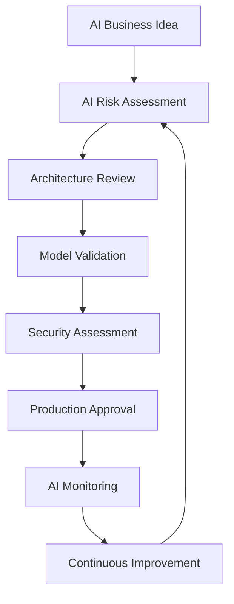
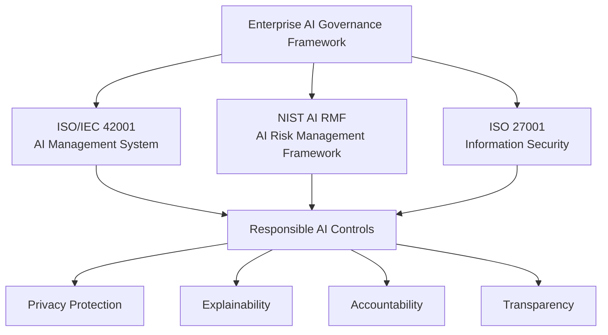
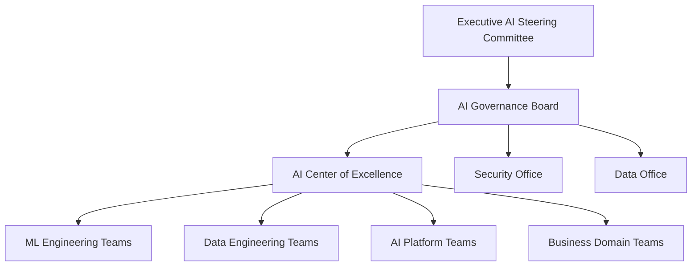
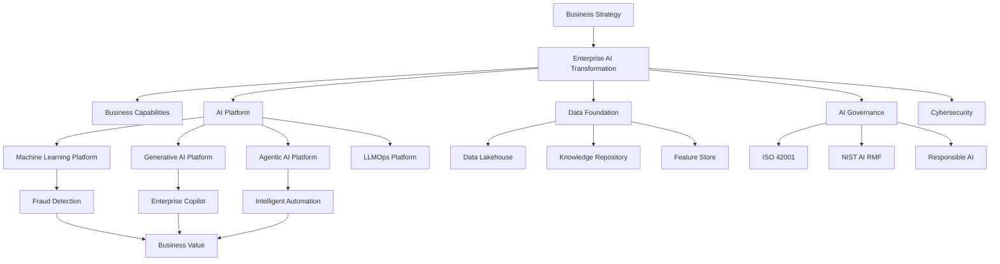
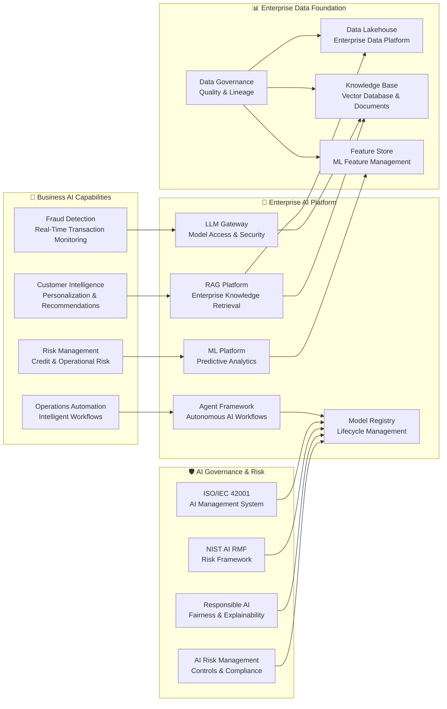
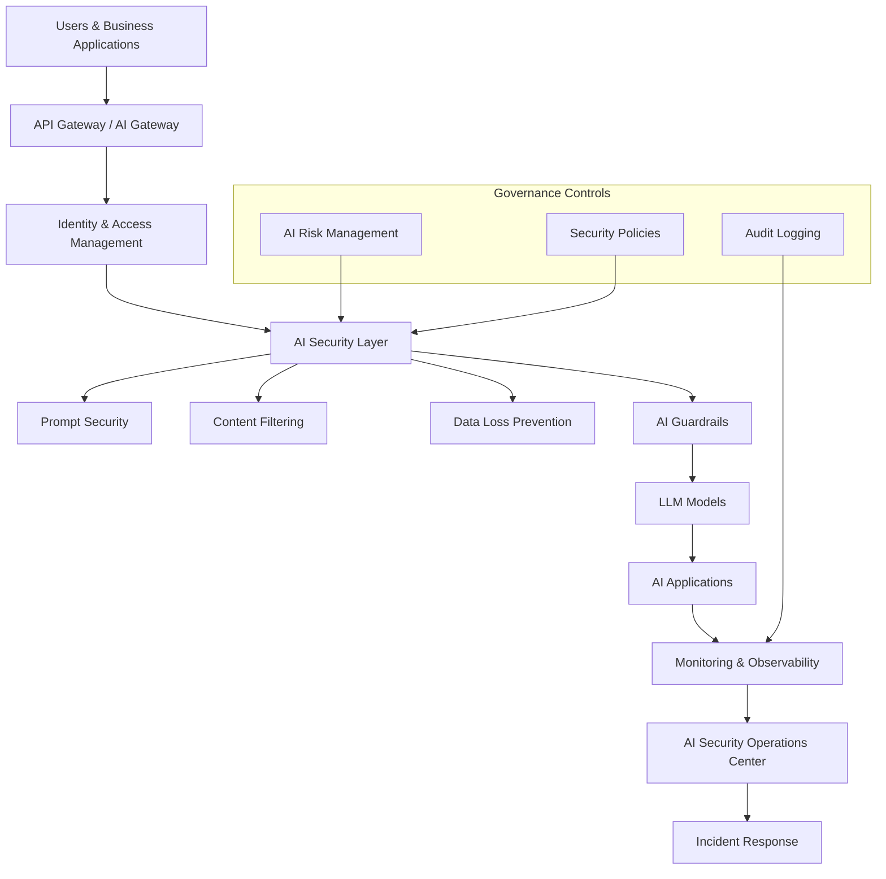
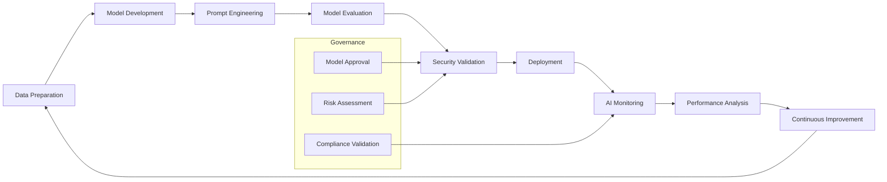
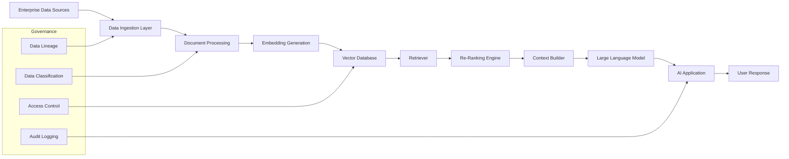
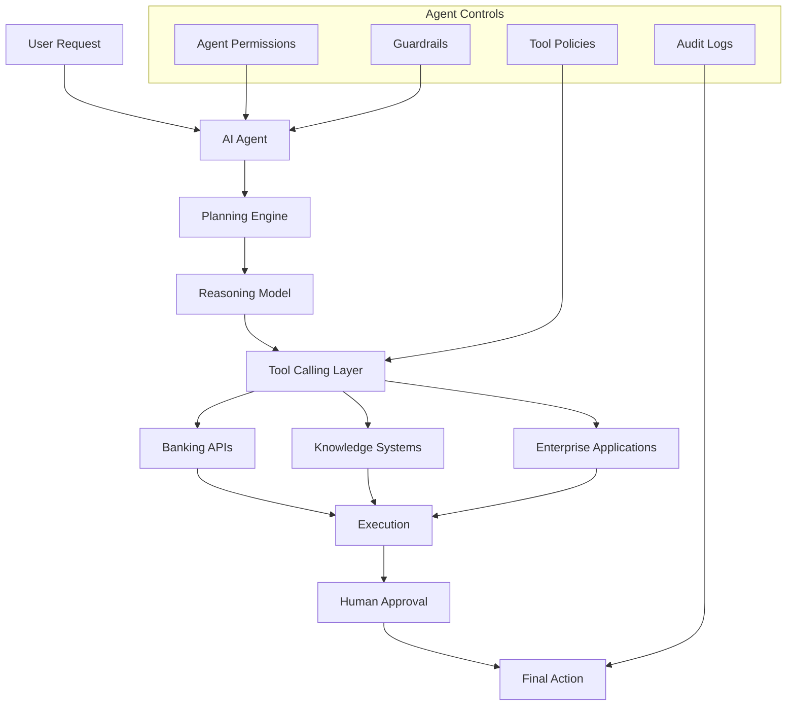

# 🎯 3. Strategic Drivers

## Overview

The **GlobalBank Enterprise AI Transformation Program** is driven by a combination of strategic business objectives, technology modernization initiatives, data capabilities, security requirements, governance principles, regulatory obligations, and operational transformation goals.

These strategic drivers establish the foundation for creating an enterprise-scale Artificial Intelligence capability that enables GlobalBank to transform traditional banking operations into intelligent, predictive, and automated business processes.

The adoption of Enterprise AI represents a strategic evolution from isolated analytical solutions toward a governed AI ecosystem capable of supporting Machine Learning (ML), Generative AI (GenAI), Large Language Models (LLMs), and Agentic AI capabilities.

The transformation will establish a **Secure Enterprise AI Platform** supported by cloud-native architecture, governed enterprise data, AI lifecycle management, responsible AI principles, and strong cybersecurity controls.

---

# 🏦 3.1 Business Drivers

## Business Motivation

GlobalBank operates in a highly competitive and regulated financial ecosystem where transaction volumes, digital interactions, cybersecurity threats, fraud techniques, and customer expectations continue to grow exponentially.

Traditional rule-based systems and fragmented analytical capabilities are no longer sufficient to detect sophisticated financial threats, provide personalized customer experiences, or support real-time business decisions.

Enterprise AI enables GlobalBank to transition from reactive operational models toward predictive, intelligent, and automated decision-making capabilities that improve customer value, operational efficiency, and business agility.

```flowchart TB

%% =========================
%% Stakeholder
%% =========================

S1["🏦 GlobalBank Leadership<br/>Executive Committee"]
S2["👥 Customers"]
S3["💼 Business Units"]
S4["⚖️ Regulators"]


%% =========================
%% Business Drivers
%% =========================

subgraph Drivers["🎯 Business Drivers"]

D1["Fraud Prevention<br/>Reduce financial losses"]
D2["Customer Trust<br/>Improve security and transparency"]
D3["Digital Experience<br/>Personalized banking interactions"]
D4["Operational Efficiency<br/>Optimize business processes"]
D5["Faster Decisions<br/>Real-time risk evaluation"]
D6["Employee Productivity<br/>AI Copilots & Assistants"]
D7["Market Differentiation<br/>Innovation advantage"]

end


%% =========================
%% Business Goals
%% =========================

subgraph Goals["🚀 Strategic Business Goals"]

G1["Reduce Financial Risk"]
G2["Improve Customer Experience"]
G3["Increase Operational Efficiency"]
G4["Enable Intelligent Decision Making"]
G5["Accelerate Digital Innovation"]

end


%% =========================
%% AI Capabilities
%% =========================

subgraph Capabilities["🤖 Enterprise AI Capabilities"]

C1["AI Fraud Detection<br/>Predictive Analytics"]

C2["Customer Intelligence<br/>Personalization Engine"]

C3["Intelligent Automation<br/>AI Workflows"]

C4["Real-Time Decision Intelligence"]

C5["AI Copilots<br/>Employee Productivity"]

end


%% =========================
%% Business Value
%% =========================

subgraph Value["💎 Business Value"]

V1["Customer Value"]

V2["Operational Excellence"]

V3["Risk Reduction"]

V4["Competitive Advantage"]

end


%% =========================
%% Relationships
%% =========================


S1 --> D1
S1 --> D4
S1 --> D7

S2 --> D2
S2 --> D3

S3 --> D5
S3 --> D6

S4 --> D1


D1 --> G1
D2 --> G2
D3 --> G2
D4 --> G3
D5 --> G4
D6 --> G3
D7 --> G5


G1 --> C1
G2 --> C2
G3 --> C3
G4 --> C4
G5 --> C5


C1 --> V3
C2 --> V1
C3 --> V2
C4 --> V2
C5 --> V2

V1 --> V4
V2 --> V4
V3 --> V4
---

## Key Business Drivers

| Driver | Business Impact |
|---|---|
| Fraud Prevention | Reduce financial losses through intelligent detection and predictive analytics |
| Customer Trust | Improve security, transparency, and confidence in digital banking services |
| Digital Experience | Deliver personalized and intelligent customer interactions |
| Operational Efficiency | Reduce manual activities and optimize business processes |
| Faster Decisions | Enable real-time risk evaluation and business intelligence |
| Employee Productivity | Provide AI copilots and intelligent assistants |
| Market Differentiation | Accelerate innovation and competitive advantage |

---

# ⚙️ 3.2 Technology Drivers

## Technology Motivation

GlobalBank currently operates within a complex technology ecosystem composed of legacy platforms, independent Machine Learning models, disconnected data environments, and inconsistent AI implementation approaches.

These limitations increase operational complexity, reduce scalability, and prevent the organization from rapidly deploying AI capabilities across multiple business domains.

The target architecture requires a modern Enterprise AI Platform based on cloud-native principles, reusable AI services, API-driven integration, automation, event-driven architectures, and enterprise-grade operational resilience.

## Current Technology Challenges

- Legacy fraud detection platforms.
- Independent machine learning solutions.
- Fragmented analytical environments.
- Manual AI deployment processes.
- Limited AI monitoring capabilities.
- Lack of standardized AI lifecycle management.

## Key Technology Drivers

- Establish an Enterprise AI Platform.
- Modernize legacy technology platforms.
- Enable cloud-native AI services.
- Implement API-first architecture.
- Adopt event-driven processing.
- Enable real-time analytics.
- Standardize ML and LLM lifecycle management.
- Implement MLOps and LLMOps capabilities.
- Enable reusable AI components.
- Improve platform resilience and scalability.

---

# 📊 3.3 Data & Information Drivers

## Data Motivation

Enterprise AI depends on trusted, governed, high-quality, and accessible data. Data represents the strategic foundation required to enable predictive analytics, Generative AI solutions, and intelligent autonomous agents.

GlobalBank requires a modern enterprise data foundation capable of integrating structured and unstructured information from multiple business domains while maintaining security, lineage, quality, and regulatory compliance.

The organization must evolve from traditional data platforms toward a governed data ecosystem supporting Data Products, Data Mesh principles, Knowledge Management, and Retrieval-Augmented Generation (RAG) architectures.

# 📊 Key Data Drivers

## Data Motivation

Enterprise Artificial Intelligence depends on the availability of trusted, high-quality, governed, and accessible data. For GlobalBank, data represents a strategic asset that enables advanced analytics, Machine Learning models, Generative AI applications, and intelligent autonomous capabilities.

As the organization expands its AI adoption, traditional data management approaches are no longer sufficient to support the complexity, volume, and velocity of modern financial information. GlobalBank requires a modern enterprise data foundation capable of providing reliable, secure, and contextualized information across business domains.

The Data Transformation strategy focuses on establishing strong data governance, improving data quality, enabling real-time data access, and creating reusable data capabilities that support business innovation while maintaining regulatory compliance.

By implementing modern data architecture practices such as Data Mesh, enterprise knowledge repositories, semantic search, and Retrieval-Augmented Generation (RAG), GlobalBank will enable AI solutions to generate accurate, explainable, and business-relevant insights.

---

## Key Data Drivers

| Data Driver | Business Impact |
|---|---|
| Establish Enterprise Data Governance | Ensure accountability, ownership, security, and regulatory compliance across enterprise data assets |
| Improve Enterprise Data Quality | Increase accuracy, consistency, and reliability of AI-driven decisions |
| Create Trusted Data Products | Enable reusable and governed data capabilities across business domains |
| Enable Real-Time Data Availability | Support faster decision-making and real-time customer experiences |
| Implement Data Mesh Capabilities | Enable decentralized data ownership with enterprise governance standards |
| Build Enterprise Knowledge Repositories | Provide trusted information sources for Generative AI and RAG applications |
| Enable Semantic Search Capabilities | Improve enterprise knowledge discovery and contextual information retrieval |
| Support Retrieval-Augmented Generation (RAG) | Provide accurate enterprise context to Large Language Models |
| Improve Metadata Management | Increase visibility, discoverability, and understanding of data assets |
| Establish Complete Data Lineage | Enable traceability, auditability, and regulatory transparency |

---

## Strategic Data Outcome

The GlobalBank Enterprise Data Foundation will provide the trusted information ecosystem required to scale Artificial Intelligence across the organization.

By combining governance, quality management, real-time capabilities, and AI-ready data platforms, GlobalBank will transform data into a strategic capability that enables secure innovation, intelligent decision-making, and sustainable business growth.

---

## Data Capabilities Required

To enable enterprise-scale Artificial Intelligence, GlobalBank requires a modern data architecture capable of supporting Machine Learning, Generative AI, and advanced analytics use cases across the organization. The data ecosystem must provide trusted, governed, and scalable capabilities that allow business domains to access high-quality information while maintaining security, compliance, and operational resilience.

The target data architecture establishes a foundation where structured and unstructured enterprise data can be ingested, processed, governed, and transformed into actionable intelligence. By combining Enterprise Data Platforms, Data Lakehouse capabilities, Feature Stores, and Knowledge Bases, GlobalBank can accelerate AI adoption, improve decision-making, and enable intelligent business services across multiple financial domains.



## Data Architecture Flow Explanation

The Enterprise Data Architecture flow represents how GlobalBank transforms raw enterprise information into intelligent business capabilities. Data originates from multiple enterprise sources, including transactional systems, customer platforms, operational applications, external data providers, and regulatory information repositories. These data assets are consolidated through the Enterprise Data Platform, which provides centralized capabilities for data ingestion, integration, governance, security, and lifecycle management.

The Data Lakehouse acts as the foundation for storing and processing structured and unstructured data at enterprise scale. From this governed data foundation, specialized capabilities are enabled through the Feature Store and Knowledge Base. The Feature Store provides curated and reusable data features for Machine Learning applications, while the Knowledge Base supports Generative AI solutions by providing contextual enterprise information for Retrieval-Augmented Generation (RAG) scenarios. Both AI capabilities contribute to Business Decision Intelligence by enabling predictive analytics, intelligent automation, faster risk assessment, and data-driven decision-making across GlobalBank.

---

# 🛡️ 3.4 Security & Cyber Risk Drivers

## Security Motivation

Artificial Intelligence introduces new cybersecurity challenges that require security controls beyond traditional application protection mechanisms.

Large Language Models, AI Agents, and Generative AI applications introduce new attack vectors including prompt injection, data leakage, model manipulation, insecure tool execution, and unauthorized autonomous actions.

GlobalBank requires an AI Security by Design approach where security controls are embedded throughout the complete AI lifecycle, from data preparation and model development to deployment and operational monitoring.

# 🛡️ AI Security Challenges & Security Drivers

## Security Architecture Introduction

The adoption of Artificial Intelligence, Generative AI, and autonomous AI agents introduces a new generation of cybersecurity risks that extend beyond traditional application security models. AI systems process sensitive financial information, interact with enterprise data sources, consume external knowledge, and may execute automated actions, creating additional attack surfaces that require specialized protection mechanisms.

GlobalBank must establish an AI Security framework that integrates security controls throughout the complete AI lifecycle, from data preparation and model development to deployment and operational monitoring. The security strategy must combine Zero Trust principles, AI threat modeling, secure architecture patterns, continuous monitoring, and governance controls to ensure secure, reliable, and compliant AI adoption.

---

# AI Security Challenges

| Security Challenge | Description | Business Impact |
|---|---|---|
| Prompt Injection | Attackers manipulate AI instructions through malicious prompts to bypass intended behavior or security controls. | Unauthorized actions, incorrect responses, and potential exposure of protected information. |
| Data Leakage | Sensitive enterprise or customer information is unintentionally exposed through AI interactions, training data, prompts, or generated responses. | Regulatory violations, privacy risks, financial penalties, and customer trust impact. |
| Model Manipulation | Attackers modify, influence, or exploit AI models to produce inaccurate or harmful outputs. | Incorrect business decisions, operational risks, and reduced AI reliability. |
| Jailbreaking Attacks | Techniques used to bypass AI safety restrictions and force models to generate prohibited or unsafe responses. | Security policy violations and uncontrolled AI behavior. |
| Tool Abuse | Unauthorized or malicious use of AI-connected tools, APIs, databases, or enterprise systems. | Unauthorized transactions, data modification, and operational disruption. |
| Agent Privilege Escalation | AI agents obtain excessive permissions or execute actions beyond their intended authorization scope. | Increased risk of automated security breaches and business process compromise. |
| Sensitive Information Exposure | AI systems reveal confidential customer, financial, or organizational information through responses or integrations. | Privacy breaches, compliance issues, and reputational damage. |

---

# Key Security Drivers

| Security Driver | Description | Objective |
|---|---|---|
| AI Security by Design | Integrate security controls from the initial AI architecture and development phases. | Reduce vulnerabilities before AI solutions reach production. |
| Protect Sensitive Banking Information | Apply encryption, access controls, classification, and data protection mechanisms. | Protect customer and financial information. |
| Secure LLM Interactions | Protect communication between users, applications, AI gateways, and Large Language Models. | Prevent unauthorized access and malicious AI usage. |
| Implement AI Threat Modeling | Identify AI-specific threats, attack vectors, and mitigation strategies. | Proactively manage AI security risks. |
| Apply Zero Trust Principles | Continuously validate identity, permissions, data access, and AI actions. | Ensure least privilege and secure interactions. |
| Protect AI APIs | Secure APIs connecting AI models, applications, agents, and enterprise systems. | Prevent unauthorized access and API exploitation. |
| Monitor AI Behavior | Implement observability for AI responses, models, agents, and user interactions. | Detect anomalies and security incidents. |
| Implement AI Guardrails | Establish controls for prompts, responses, content filtering, and model behavior. | Ensure safe and responsible AI operation. |
| Control AI Agent Permissions | Define authorization boundaries, tool access, and human approval requirements. | Prevent autonomous actions beyond business limits. |
| Validate Third-Party AI Providers | Assess external models, platforms, and vendors for security and compliance requirements. | Reduce supply-chain and third-party AI risks. |

---

## Strategic Security Outcome

By implementing these security drivers, GlobalBank establishes a secure AI operating model capable of supporting enterprise-scale Artificial Intelligence adoption while protecting customer trust, regulatory compliance, and business resilience.
---

## Security Framework Alignment

GlobalBank aligns its AI Security Architecture with internationally recognized security, risk management, and governance frameworks to ensure that Artificial Intelligence capabilities are implemented in a secure, responsible, and compliant manner. These frameworks provide structured guidance for identifying AI-related risks, establishing security controls, managing operational processes, and maintaining accountability throughout the AI lifecycle.

By adopting a combination of AI-specific and enterprise security standards, GlobalBank ensures that Machine Learning models, Generative AI applications, Large Language Models, and AI agents operate within a controlled environment. This alignment enables continuous risk management, regulatory compliance, protection of sensitive financial information, and the establishment of trust in AI-driven business decisions.


| Framework | Purpose |
|---|---|
| NIST AI RMF | Artificial Intelligence Risk Management |
| ISO/IEC 42001 | AI Management System Governance |
| OWASP Top 10 for LLM Applications | LLM Security Risks |
| ISO/IEC 27001 | Information Security Management |
| PCI DSS | Payment Data Protection |

---
# 🏛️ 3.5 Governance Drivers

## Governance Motivation

Scaling Artificial Intelligence across a global financial institution requires a strong governance framework that balances innovation, business agility, operational efficiency, and enterprise risk management.

Without proper governance mechanisms, AI adoption may introduce risks related to inaccurate decisions, lack of transparency, regulatory violations, uncontrolled model usage, and inadequate accountability.

GlobalBank must establish an enterprise AI governance model that defines ownership, decision rights, approval processes, lifecycle controls, and accountability across AI solutions, including Machine Learning models, Generative AI applications, Large Language Models, and autonomous AI agents.

# 🏛️ AI Governance Scope

## Governance Scope Introduction

Enterprise AI adoption requires a comprehensive governance model that provides visibility, control, and accountability across all components involved in the AI lifecycle. GlobalBank must ensure that Artificial Intelligence solutions are designed, developed, deployed, and operated within a controlled framework that addresses security, regulatory compliance, operational risk, and responsible AI principles.

The AI Governance Scope extends beyond traditional model management by including data assets, prompts, retrieval mechanisms, autonomous agents, external AI providers, and production environments. This holistic approach enables GlobalBank to maintain transparency, traceability, and oversight while scaling AI capabilities across business domains.

---

## AI Governance Scope

| Governance Area | Description | Key Controls |
|---|---|---|
| **AI Models** | Governance of Machine Learning models, Large Language Models, and AI algorithms throughout their lifecycle. | Model approval, version control, performance monitoring, explainability, and risk assessment. |
| **Training Datasets** | Management of datasets used to train, fine-tune, or evaluate AI models. | Data quality validation, data lineage, classification, privacy protection, and access control. |
| **Prompts** | Governance of prompts used to interact with Generative AI models. | Prompt standards, security validation, version management, and prompt injection protection. |
| **Retrieval Sources** | Control of enterprise knowledge repositories used by RAG solutions. | Source validation, access permissions, content governance, and information accuracy controls. |
| **AI Agents** | Governance of autonomous AI agents capable of reasoning and executing business actions. | Agent identity, permission management, tool restrictions, human approval, and audit logging. |
| **Automated Decisions** | Oversight of AI-driven decisions impacting customers, employees, and business operations. | Explainability, fairness evaluation, human oversight, and decision traceability. |
| **Third-Party AI Providers** | Management of external AI models, platforms, and service providers. | Vendor assessment, security reviews, contractual controls, compliance validation, and monitoring. |
| **AI Operational Environments** | Governance of AI platforms and runtime environments where solutions are deployed. | Infrastructure security, monitoring, incident management, compliance controls, and operational resilience. |

---

## Governance Outcome

By establishing governance across these areas, GlobalBank ensures that AI solutions remain secure, transparent, explainable, and aligned with enterprise policies and regulatory expectations.

This governance model enables responsible AI scaling by providing continuous oversight across the complete AI ecosystem, from initial development through production operations and continuous improvement.

## Key Governance Drivers
Scaling Artificial Intelligence across GlobalBank requires a strong governance foundation that enables innovation while maintaining control, accountability, and regulatory compliance. AI governance ensures that business leaders, technology teams, data owners, security teams, and risk functions have clearly defined responsibilities throughout the complete AI lifecycle.

The governance model establishes the decision-making framework required to manage AI solutions from ideation to production operation. By defining ownership, approval processes, risk controls, transparency mechanisms, and oversight practices, GlobalBank can accelerate AI adoption while ensuring responsible, secure, and ethical use of Artificial Intelligence.

- Establish an AI Governance Board.
- Define AI ownership and accountability.
- Create AI approval lifecycle processes.
- Implement Responsible AI practices.
- Enable model transparency.
- Manage AI risks.
- Maintain audit trails.
- Govern third-party AI services.
- Establish enterprise AI policies.
- Define human oversight mechanisms.

---

## AI Governance Lifecycle

The AI Governance Lifecycle defines the structured process that GlobalBank follows to ensure Artificial Intelligence solutions are evaluated, approved, deployed, and continuously managed in a secure, responsible, and compliant manner. This lifecycle provides a consistent governance framework that integrates business objectives, enterprise architecture, cybersecurity, risk management, and regulatory requirements throughout the AI journey.

By establishing a controlled AI lifecycle, GlobalBank ensures that every AI initiative receives the appropriate level of evaluation before reaching production. The governance process enables transparency, accountability, risk mitigation, and continuous improvement while allowing business teams to innovate with confidence.



## AI Governance Lifecycle Flow Explanation

The lifecycle begins with an **AI Business Idea**, where business stakeholders identify opportunities where Artificial Intelligence can generate measurable value. The initiative then moves through an **AI Risk Assessment** phase, where potential risks related to security, privacy, regulatory compliance, operational impact, and responsible AI principles are evaluated.

After risk evaluation, the solution undergoes an **Architecture Review** to validate alignment with enterprise architecture standards, technology strategies, data requirements, and security principles. The **Model Validation** stage evaluates AI model performance, accuracy, fairness, explainability, and business suitability before progressing to production readiness.

The **Security Assessment** phase ensures that AI solutions meet cybersecurity requirements, including data protection, access control, vulnerability analysis, and AI-specific security controls. Once all requirements are satisfied, the solution receives **Production Approval** and is deployed into the operational environment.

After deployment, **AI Monitoring** continuously evaluates model performance, security behavior, compliance status, and operational metrics. The lifecycle concludes with **Continuous Improvement**, where feedback, performance insights, and emerging risks are incorporated to improve the AI solution and restart the governance cycle.


---

# 📜 3.6 Regulatory & Compliance Drivers

## Compliance Motivation

Financial institutions operate under strict regulatory environments where transparency, accountability, privacy protection, and operational resilience are mandatory requirements.

The increasing adoption of Artificial Intelligence requires GlobalBank to ensure that AI solutions comply with regulatory expectations while maintaining explainability, fairness, auditability, and responsible decision-making.

The Enterprise AI Transformation Program must integrate regulatory requirements into architecture standards, development practices, operational processes, and governance controls.

## Key Compliance Drivers

Financial institutions operate within a highly regulated environment where transparency, accountability, security, and operational resilience are essential requirements. As GlobalBank expands its adoption of Machine Learning, Generative AI, and Agentic AI capabilities, compliance becomes a critical enabler to ensure that AI solutions operate within regulatory expectations and enterprise risk management frameworks.

The AI compliance strategy establishes the controls, processes, and governance mechanisms required to ensure responsible AI adoption. GlobalBank must maintain visibility into AI decisions, protect customer information, demonstrate accountability, and provide evidence of compliance throughout the complete AI lifecycle.

| Compliance Driver | Description | Objective |
|---|---|---|
| **Meet Financial Regulatory Expectations** | Ensure AI solutions comply with applicable banking regulations, industry standards, and supervisory requirements. | Maintain regulatory alignment and reduce compliance risk. |
| **Support Internal and External Audits** | Provide documentation, evidence, controls, and traceability required for audit activities. | Enable audit readiness and regulatory transparency. |
| **Maintain AI Explainability** | Ensure AI-driven decisions can be understood, interpreted, and justified. | Increase trust and support responsible decision-making. |
| **Protect Customer Privacy** | Apply privacy protection controls for customer data used by AI systems. | Prevent unauthorized data exposure and privacy violations. |
| **Ensure Ethical AI Adoption** | Implement Responsible AI principles including fairness, transparency, and non-discrimination. | Promote trustworthy and sustainable AI usage. |
| **Enable Regulatory Reporting** | Provide accurate information about AI models, risks, decisions, and operational performance. | Support regulatory oversight and reporting obligations. |
| **Maintain Operational Resilience** | Ensure AI platforms remain available, reliable, and recoverable under operational disruptions. | Protect critical banking services and business continuity. |
| **Demonstrate AI Accountability** | Define ownership, responsibilities, and decision authority for AI systems. | Ensure clear governance and accountability throughout the AI lifecycle. |

---

## Regulatory Alignment Framework

GlobalBank requires a comprehensive regulatory alignment framework to ensure that Artificial Intelligence capabilities are developed, deployed, and operated according to international standards, financial regulations, and responsible AI principles. As AI adoption expands across business domains, regulatory alignment becomes essential to manage risks related to security, privacy, transparency, and automated decision-making.

The regulatory framework integrates AI governance, information security, and risk management practices to establish a consistent control environment. By aligning with recognized standards such as **ISO/IEC 42001, NIST AI Risk Management Framework, and ISO/IEC 27001**, GlobalBank can enable scalable AI innovation while maintaining accountability, regulatory compliance, and customer trust.


## Regulatory Alignment Architecture Flow Explanation

The **Enterprise AI Governance Framework** acts as the central governance layer that coordinates AI management practices, security controls, and regulatory requirements across the organization. This framework integrates multiple international standards to provide a holistic approach for managing AI risks and ensuring responsible adoption.

The **ISO/IEC 42001 AI Management System** provides governance structures, policies, roles, and lifecycle controls for managing Artificial Intelligence responsibly. The **NIST AI Risk Management Framework (AI RMF)** provides a structured approach to identify, measure, manage, and monitor AI risks. The **ISO/IEC 27001 Information Security Management System** ensures that AI platforms and supporting infrastructure maintain strong cybersecurity controls.

Together, these frameworks enable the implementation of **Responsible AI Controls**, which establish the foundation for privacy protection, explainability, accountability, and transparency. These principles ensure that AI solutions remain secure, trustworthy, auditable, and aligned with GlobalBank's regulatory obligations.

---

# 🚀 3.7 Innovation & Competitive Drivers

## Innovation Motivation

Artificial Intelligence represents a strategic capability that enables GlobalBank to differentiate itself in a rapidly changing financial services market.

The adoption of Generative AI, intelligent automation, and autonomous AI agents allows the organization to create new customer experiences, improve employee productivity, and accelerate innovation cycles.

Enterprise AI becomes a business capability that supports continuous innovation while maintaining security, governance, and regulatory compliance.

## Key Innovation Drivers

Artificial Intelligence represents a strategic capability that enables GlobalBank to transform the way financial services are designed, delivered, and continuously improved. The adoption of Generative AI, intelligent assistants, and autonomous AI agents creates new opportunities to enhance customer experiences, optimize operations, and develop innovative financial products.

Innovation through AI requires more than implementing isolated solutions; it requires an enterprise approach that combines advanced technologies, trusted data, business capabilities, and responsible governance. GlobalBank must establish scalable AI capabilities that accelerate experimentation, improve time to market, and create sustainable competitive advantages in the evolving digital banking ecosystem.

| Innovation Driver | Description | Business Impact |
|---|---|---|
| **Enable Generative AI Capabilities** | Implement Large Language Models (LLMs), Retrieval-Augmented Generation (RAG), and AI-powered content generation capabilities. | Accelerate knowledge discovery, automation, and intelligent decision support. |
| **Create Intelligent Banking Assistants** | Develop AI assistants capable of supporting customers, employees, and business operations. | Improve service quality, productivity, and customer engagement. |
| **Deploy AI-Powered Agents** | Introduce autonomous AI agents capable of executing workflows and interacting with enterprise systems. | Increase automation and optimize complex business processes. |
| **Automate Knowledge Management** | Use AI to organize, retrieve, and enhance access to enterprise knowledge assets. | Reduce information search time and improve organizational intelligence. |
| **Improve Financial Intelligence** | Apply AI analytics to generate predictive insights and support business decisions. | Enhance risk management, forecasting, and strategic planning. |
| **Accelerate Product Innovation** | Use AI capabilities to reduce development cycles and create new financial services. | Improve time to market and competitive differentiation. |
| **Enable Ecosystem Partnerships** | Integrate AI capabilities with fintechs, technology providers, and strategic partners. | Expand innovation opportunities and digital ecosystems. |
| **Improve Customer Personalization** | Apply AI models to understand customer behavior and deliver tailored experiences. | Increase customer satisfaction, loyalty, and engagement. |
| **Support Digital Transformation Initiatives** | Embed AI capabilities into enterprise modernization programs. | Enable intelligent, agile, and future-ready banking operations. |


---

## Innovation Capability Evolution

The evolution of GlobalBank's innovation capabilities represents the transition from traditional banking operations toward an intelligent, AI-enabled enterprise. Financial institutions have historically relied on rule-based systems, manual processes, and traditional analytics; however, increasing market complexity and customer expectations require more adaptive, predictive, and automated capabilities.

This evolution introduces progressive levels of Artificial Intelligence maturity, moving from analytical insights and Machine Learning models toward Generative AI applications and autonomous AI agents. Each stage increases business intelligence, operational efficiency, and the ability to deliver personalized financial experiences while maintaining governance, security, and regulatory compliance.


## Innovation Capability Evolution Flow Explanation

The journey begins with **Traditional Banking Operations**, where business processes are primarily supported by transactional systems, manual workflows, and predefined business rules. This stage provides the operational foundation but has limited predictive capabilities and requires significant human intervention.

The next stage introduces **Analytics & Machine Learning**, enabling GlobalBank to leverage historical data, predictive models, and advanced analytics to identify patterns, detect risks, and improve decision-making. Machine Learning capabilities allow the organization to move from reactive responses toward proactive business intelligence.

The evolution continues with **Generative AI Applications**, where Large Language Models (LLMs), Retrieval-Augmented Generation (RAG), and intelligent assistants enable natural language interactions, enterprise knowledge discovery, and automated content generation.

The **Agentic AI Automation** stage introduces autonomous AI agents capable of planning, reasoning, interacting with enterprise systems, and executing complex workflows under controlled governance mechanisms.

The final maturity stage, the **Autonomous Intelligent Enterprise**, represents a future-state organization where AI capabilities are deeply integrated into business operations, enabling continuous optimization, intelligent decision-making, and adaptive digital services.
---

# 💰 3.8 Financial Drivers

## Financial Motivation

Enterprise AI investments must generate measurable business value while maintaining operational efficiency and cost optimization.

GlobalBank requires a financial management approach that evaluates AI initiatives based on business outcomes, operational improvements, risk reduction, and return on investment.

AI capabilities must be managed as strategic enterprise assets with clear financial accountability.

## Key Financial Drivers

Enterprise Artificial Intelligence investments must generate measurable business value while maintaining financial discipline, operational efficiency, and sustainable cost management. For GlobalBank, AI adoption represents a strategic investment that must deliver improvements in productivity, risk reduction, customer experience, and operational performance.

A mature AI financial management approach requires visibility into investment, operational costs, consumption patterns, and business outcomes. GlobalBank must establish mechanisms to measure AI value creation, optimize technology spending, and ensure that AI platforms, models, and services generate a positive return on investment throughout their lifecycle.

| Financial Driver | Description | Business Impact |
|---|---|---|
| **Reduce Operational Expenses** | Apply AI capabilities to automate repetitive activities, optimize workflows, and improve operational efficiency. | Lower operating costs and improve resource utilization. |
| **Increase Business Automation** | Implement AI-driven automation across business processes, customer services, and operational activities. | Reduce manual effort and increase process efficiency. |
| **Optimize Infrastructure Costs** | Apply cloud optimization, resource management, and AI workload optimization practices. | Improve cost efficiency and maximize technology investments. |
| **Improve Fraud Prevention ROI** | Use AI-driven fraud detection and predictive analytics to reduce financial losses. | Increase fraud prevention effectiveness and reduce operational risk. |
| **Reduce Manual Investigation Effort** | Automate investigation activities through AI analytics, intelligent search, and decision support capabilities. | Accelerate investigations and improve analyst productivity. |
| **Improve Employee Productivity** | Provide AI copilots and intelligent assistants to support employees in daily activities. | Increase workforce efficiency and reduce task execution time. |
| **Establish AI FinOps Practices** | Implement financial governance for AI infrastructure, models, APIs, and cloud consumption. | Enable transparency and control of AI-related expenses. |
| **Measure AI Business Value** | Define metrics to evaluate business outcomes, operational improvements, and return on AI investments. | Ensure AI initiatives deliver measurable value. |
| **Optimize AI Model Consumption Costs** | Manage model usage, inference costs, resource allocation, and model selection strategies. | Reduce AI operational expenses while maintaining performance. |

---
# 💰 AI Financial Management Model

The AI Financial Management Model establishes the framework required for GlobalBank to manage Artificial Intelligence investments as strategic business capabilities rather than isolated technology expenses. As AI adoption expands across business domains, the organization requires financial governance practices that connect technology investments with measurable business outcomes, operational improvements, and risk reduction.

This model enables GlobalBank to evaluate AI initiatives throughout their lifecycle by measuring investment efficiency, operational performance, cost optimization opportunities, and return on investment. Through AI FinOps practices and continuous value management, GlobalBank can ensure that AI platforms, models, and services deliver sustainable financial benefits while supporting enterprise innovation.

---


## AI Financial Management Model Diagram

The **AI Financial Management Model Diagram** represents the continuous financial governance lifecycle required to maximize the value of Artificial Intelligence investments across GlobalBank. This model establishes a structured approach to evaluate, implement, measure, optimize, and continuously improve AI initiatives while ensuring alignment between technology spending and measurable business outcomes.

The lifecycle connects investment decisions with business value realization by incorporating financial assessment, operational monitoring, cost optimization, and return-on-investment analysis. Through this approach, GlobalBank can maintain visibility into AI consumption costs, optimize resources, prioritize high-value initiatives, and ensure that Artificial Intelligence capabilities deliver sustainable strategic and financial benefits.

```mermaid
flowchart TD

A[AI Investment]

A --> B[Business Value Assessment]

B --> C[AI Implementation]

C --> D[Operational Measurement]

D --> E[Cost Optimization]

E --> F[ROI Analysis]

F --> G[Continuous Improvement]

G --> B

---
## AI Financial Management Flow Explanation

The lifecycle begins with **AI Investment**, where GlobalBank identifies and prioritizes AI initiatives based on strategic objectives, business needs, expected benefits, and required resources. Each initiative moves into the **Business Value Assessment** phase, where potential financial impact, operational improvements, risk reduction, and expected return are evaluated before implementation.

During **AI Implementation**, approved initiatives are deployed using governed architecture, controlled budgets, and appropriate technology capabilities. Once operational, the solution enters the **Operational Measurement** phase, where performance indicators, usage metrics, business outcomes, and financial impact are continuously monitored.

The next stage, **Cost Optimization**, focuses on improving AI efficiency by optimizing infrastructure consumption, model usage, cloud resources, and operational processes. The **ROI Analysis** phase evaluates whether the AI capability is generating the expected business value compared with the original investment.

Finally, **Continuous Improvement** ensures that AI solutions evolve based on business feedback, performance insights, cost analysis, and changing organizational priorities. This creates a continuous financial management cycle where AI investments are optimized and aligned with GlobalBank's strategic objectives.
---

## AI Value Management Model

The **AI Value Management Model** defines how GlobalBank evaluates, measures, and maximizes the business value generated by Artificial Intelligence initiatives throughout their lifecycle. As AI becomes a strategic enterprise capability, the organization requires a structured approach to ensure that investments are aligned with business objectives, measurable outcomes, operational improvements, and long-term strategic priorities.

This model establishes a continuous value management cycle that connects AI investments with business impact. By combining business value assessment, implementation governance, operational measurement, ROI analysis, and continuous optimization, GlobalBank can ensure that AI capabilities generate sustainable benefits, improve decision-making, and deliver measurable returns across the enterprise.

```mermaid
flowchart TD

A[AI Investment]

A --> B[Business Value Assessment]

B --> C[Implementation]

C --> D[Operational Measurement]

D --> E[ROI Analysis]

E --> F[Continuous Optimization]

F --> B
```
---
## AI Value Management Flow Explanation

The lifecycle begins with **AI Investment**, where GlobalBank identifies and prioritizes AI initiatives based on strategic objectives, business opportunities, expected benefits, and required investments. Each initiative moves into the **Business Value Assessment** phase, where financial impact, operational improvements, risk reduction, and success criteria are defined.

During the **Implementation** phase, approved AI initiatives are developed and deployed following enterprise architecture, security, governance, and operational standards. After deployment, the organization performs **Operational Measurement** to evaluate AI performance, adoption levels, business outcomes, efficiency improvements, and alignment with expected objectives.

The **ROI Analysis** phase evaluates the economic impact of AI capabilities by comparing investment costs with realized business benefits. The lifecycle continues with **Continuous Optimization**, where GlobalBank improves AI performance, reduces operational costs, optimizes resource consumption, and identifies new opportunities for additional value creation.
---

# 👥 3.9 Operating Model Drivers

## Operating Model Transformation

Successful AI adoption requires organizational transformation beyond technology implementation.

GlobalBank must establish a collaborative operating model that combines business stakeholders, enterprise architects, data teams, cybersecurity specialists, AI engineers, and governance functions.

The target operating model enables decentralized innovation while maintaining centralized governance, standards, security controls, and enterprise architecture alignment.


## 👥 Target Operating Model

The **Target Operating Model (TOM)** defines the organizational structure, governance responsibilities, and collaboration model required for GlobalBank to scale Artificial Intelligence capabilities across the enterprise. AI transformation requires coordinated participation between business leaders, technology teams, data organizations, cybersecurity functions, and risk management areas to ensure that AI initiatives deliver business value while maintaining security, compliance, and operational control.

The GlobalBank AI Operating Model establishes clear decision rights, ownership responsibilities, and collaboration mechanisms across the AI ecosystem. By combining executive governance, AI centers of excellence, security oversight, data management, and specialized delivery teams, the organization can accelerate AI adoption while ensuring responsible, scalable, and sustainable AI operations.



---
## Target Operating Model Flow Explanation

The operating model begins with the **Executive AI Steering Committee**, which provides strategic direction, investment prioritization, executive sponsorship, and alignment between AI initiatives and business objectives. This committee ensures that Artificial Intelligence becomes an enterprise capability aligned with GlobalBank's strategic vision.

The **AI Governance Board** operates below the executive level and provides governance oversight across AI initiatives. It defines policies, approval processes, risk management practices, responsible AI requirements, and lifecycle controls to ensure that AI solutions comply with enterprise standards and regulatory expectations.

The **AI Center of Excellence (AI CoE)** acts as the central enablement function responsible for AI strategy execution, architecture standards, reusable capabilities, best practices, and technical guidance. The AI CoE collaborates with specialized teams including **ML Engineering Teams**, **Data Engineering Teams**, **AI Platform Teams**, and **Business Domain Teams** to deliver AI solutions across the organization.

The **Security Office** ensures that AI solutions follow cybersecurity requirements, AI security principles, threat modeling practices, and risk mitigation controls. The **Data Office** manages enterprise data governance, data quality, metadata management, lineage, and AI-ready data capabilities required to support Machine Learning and Generative AI workloads.

Together, these functions create an operating model that balances innovation, governance, security, and business value, enabling GlobalBank to scale AI capabilities across multiple business domains.
---

# 🏗️ Enterprise AI Strategic Architecture

## Strategic Architecture Overview

The Enterprise AI Strategic Architecture defines how business capabilities, AI services, data foundations, and governance controls work together to enable secure and scalable Artificial Intelligence adoption.

This architecture establishes the foundation required to support Machine Learning, Generative AI, Retrieval-Augmented Generation (RAG), and Agentic AI capabilities across GlobalBank.


---
## Strategic Architecture Flow Explanation

The architecture begins with **Business Strategy**, which defines GlobalBank's strategic objectives, customer expectations, regulatory requirements, and transformation priorities. These objectives drive the **Enterprise AI Transformation Program**, which translates business needs into enterprise capabilities, technology platforms, data capabilities, governance structures, and cybersecurity requirements.

The **Business Capabilities Layer** represents the organizational capabilities that AI enables, including fraud prevention, customer intelligence, risk management, operational automation, and intelligent decision-making. These capabilities are supported by the **Enterprise AI Platform**, which provides the technology foundation required to develop, deploy, and operate AI solutions.

The **AI Platform Layer** contains specialized capabilities including the **Machine Learning Platform**, **Generative AI Platform**, **Agentic AI Platform**, and **LLMOps Platform**. These services enable predictive analytics, enterprise copilots, autonomous workflows, model lifecycle management, monitoring, and continuous optimization.

The **Data Foundation Layer** provides the trusted information ecosystem required for AI success. The **Data Lakehouse**, **Knowledge Repository**, and **Feature Store** enable governed data access, enterprise knowledge retrieval, and reusable machine learning capabilities.

The **AI Governance Layer** ensures responsible and controlled AI adoption through frameworks such as **ISO/IEC 42001**, **NIST AI RMF**, and Responsible AI principles. These controls provide transparency, risk management, explainability, accountability, and regulatory alignment.

The **Cybersecurity Layer** protects AI systems, models, data, APIs, and users through security-by-design principles, Zero Trust architecture, AI threat management, and continuous monitoring.

Together, these architectural layers enable GlobalBank to deliver measurable business value through AI-powered capabilities such as fraud detection, enterprise copilots, and intelligent automation.
---

# 🏦 Enterprise AI Capability Map

The GlobalBank Enterprise AI Capability Map represents the strategic capabilities required to transform Artificial Intelligence into an enterprise-wide business capability.

The capability model connects business outcomes with AI platforms, data foundations, security controls, and governance mechanisms. It provides a common language between business leaders, architects, engineers, cybersecurity teams, and regulatory stakeholders.

The capability map enables GlobalBank to identify investment priorities, define architecture roadmaps, avoid duplicated solutions, and accelerate AI adoption across different business domains.

---



---
## Enterprise AI Capability Map Flow Explanation

The capability model is organized into four strategic layers that represent the foundation required for successful AI transformation.

The **Business AI Capabilities Layer** represents the business outcomes and operational capabilities enhanced through Artificial Intelligence. These capabilities include **Fraud Detection**, **Customer Intelligence**, **Risk Management**, and **Operations Automation**. Each capability addresses critical banking challenges by enabling predictive analysis, personalized services, intelligent decision-making, and automated workflows.

The **Enterprise AI Platform Layer** provides the reusable technology services required to enable AI capabilities across the organization. The **LLM Gateway** provides secure access to Large Language Models, the **RAG Platform** enables enterprise knowledge retrieval, the **ML Platform** supports predictive analytics, the **Agent Framework** enables autonomous workflows, and the **Model Registry** provides lifecycle management and governance for AI models.

The **Enterprise Data Foundation Layer** provides the trusted information ecosystem required for AI workloads. The **Data Lakehouse** consolidates enterprise information, the **Knowledge Base** supports Generative AI and RAG scenarios, the **Feature Store** provides reusable machine learning features, and **Data Governance** ensures quality, lineage, security, and compliance.

The **AI Governance & Risk Layer** establishes the controls required for responsible and secure AI adoption. Frameworks such as **ISO/IEC 42001**, **NIST AI RMF**, Responsible AI practices, and AI Risk Management processes ensure transparency, explainability, accountability, and regulatory alignment throughout the AI lifecycle.

Together, these layers create an enterprise AI ecosystem where business capabilities consume governed AI services, AI platforms leverage trusted data foundations, and governance mechanisms ensure secure and responsible operation.
---

# 🔐 AI Security Architecture


Enterprise Artificial Intelligence introduces additional security challenges beyond traditional application architectures because AI systems process sensitive information, consume external knowledge sources, interact with enterprise applications, and may execute autonomous actions through intelligent agents.

Unlike traditional applications, AI solutions require protection against new attack vectors such as prompt injection, model manipulation, data leakage, insecure tool execution, jailbreak attacks, and unauthorized agent behavior.

GlobalBank requires an **AI Security Architecture based on Zero Trust principles, Secure-by-Design practices, continuous monitoring, and risk-based security controls**.

The security architecture protects AI models, enterprise data, prompts, agents, APIs, users, and business processes throughout the complete AI lifecycle.
---
# 🔐 AI Security Architecture


Enterprise Artificial Intelligence introduces additional security challenges beyond traditional application architectures because AI systems process sensitive information, consume external knowledge sources, interact with enterprise applications, and may execute autonomous actions through intelligent agents.

Unlike traditional applications, AI solutions require protection against new attack vectors such as prompt injection, model manipulation, data leakage, insecure tool execution, jailbreak attacks, and unauthorized agent behavior.

GlobalBank requires an **AI Security Architecture based on Zero Trust principles, Secure-by-Design practices, continuous monitoring, and risk-based security controls**.

The security architecture protects AI models, enterprise data, prompts, agents, APIs, users, and business processes throughout the complete AI lifecycle.

---

## AI Security Principles

The adoption of Artificial Intelligence within GlobalBank requires a security approach specifically designed to address the unique risks introduced by Machine Learning models, Generative AI applications, Large Language Models, and autonomous AI agents. Traditional cybersecurity controls must be extended with AI-specific protection mechanisms that safeguard data, models, prompts, integrations, and automated decisions throughout the AI lifecycle.

The AI Security Principles establish the foundational guidelines required to build secure, trustworthy, and resilient AI capabilities. These principles ensure that security, privacy, transparency, and responsible AI practices are embedded from the initial architecture design through production operations, enabling GlobalBank to scale AI innovation while maintaining customer trust and regulatory compliance.

| Principle | Description |
|---|---|
| Security by Design | Security controls embedded from AI design phase |
| Zero Trust AI | Continuous verification of users, models, data, and tools |
| Data Protection | Prevent unauthorized access and information leakage |
| Model Security | Protect AI models from manipulation and misuse |
| Responsible AI | Ensure safe, transparent, and ethical AI behavior |
| Continuous Monitoring | Detect abnormal AI behavior and security threats |

---

## AI Security Architecture

The **AI Security Architecture** defines the security controls and protection mechanisms required to safeguard GlobalBank's Artificial Intelligence ecosystem throughout its complete lifecycle. Unlike traditional application security, AI security must protect additional components such as Large Language Models (LLMs), prompts, knowledge sources, AI agents, model interactions, and automated decision processes.

GlobalBank implements a layered AI security approach based on **Zero Trust principles, defense-in-depth strategies, secure AI engineering practices, and continuous monitoring**. This architecture ensures that users, applications, data, models, and AI services operate within controlled boundaries while reducing risks such as prompt injection, data leakage, model manipulation, unauthorized access, and unsafe AI behavior.



---

## AI Security Architecture Flow Explanation

The architecture begins with **Users & Business Applications**, which represent employees, customers, and enterprise systems consuming AI-powered capabilities. All interactions are routed through the **API Gateway / AI Gateway**, which provides centralized control for authentication, authorization, traffic management, security policies, and secure access to AI services.

The **Identity & Access Management (IAM)** layer validates user identities, application permissions, and access privileges before allowing interaction with AI capabilities. This ensures that only authorized users and systems can access models, data sources, and AI-powered services according to enterprise security policies.

The **AI Security Layer** provides specialized protections for Artificial Intelligence workloads. This layer includes **Prompt Security** to detect malicious instructions and prompt injection attempts, **Content Filtering** to prevent unsafe outputs, **Data Loss Prevention (DLP)** to protect sensitive banking information, and **AI Guardrails** to enforce responsible and secure AI behavior.

The protected AI requests are then processed by **LLM Models** and consumed by **AI Applications** such as enterprise copilots, intelligent assistants, fraud detection solutions, and automated workflows. These interactions are continuously monitored through **Monitoring & Observability capabilities**, providing visibility into AI performance, security events, model behavior, and operational risks.

The **AI Security Operations Center (AI SOC)** analyzes security events and coordinates responses through **Incident Response processes**. Governance controls such as **AI Risk Management**, **Security Policies**, and **Audit Logging** provide oversight, accountability, traceability, and regulatory compliance across the complete AI ecosystem.

---

# 🔄 AI Lifecycle & LLMOps Architecture

## LLMOps Introduction

The adoption of Machine Learning, Generative AI, and Large Language Models requires operational capabilities that extend traditional DevOps and MLOps practices.

LLMOps introduces processes, automation, governance controls, and operational capabilities required to manage AI solutions throughout their lifecycle, including development, validation, deployment, monitoring, security assessment, and continuous optimization.

GlobalBank requires an enterprise LLMOps capability to guarantee reliability, scalability, regulatory compliance, operational visibility, and continuous improvement of AI solutions.

---

## LLMOps Lifecycle Capabilities

The adoption of Large Language Models (LLMs), Generative AI, and Agentic AI requires operational capabilities that extend beyond traditional software delivery practices. LLMOps provides the processes, tools, automation, and governance mechanisms required to manage AI solutions throughout their complete lifecycle, ensuring reliability, security, scalability, and continuous improvement.

For GlobalBank, LLMOps establishes the operational foundation required to move AI solutions from experimentation into enterprise production environments. By combining data management, model lifecycle control, prompt governance, automated deployment, continuous monitoring, and governance practices, the organization can ensure that AI capabilities deliver consistent business value while maintaining regulatory compliance and operational resilience.


| Capability | Description |
|---|---|
| Data Management | Preparation and validation of AI datasets |
| Model Management | Versioning and lifecycle control |
| Prompt Management | Prompt engineering and governance |
| Evaluation Framework | Quality, accuracy, and safety validation |
| Deployment Automation | CI/CD pipelines for AI workloads |
| Monitoring | Performance and behavior tracking |
| Governance | Approval workflows and auditability |

---
## LLMOps Outcome

By implementing LLMOps lifecycle capabilities, GlobalBank establishes an operational model that enables AI solutions to be managed as enterprise-grade products. This approach improves collaboration between business teams, data scientists, engineers, security teams, and governance functions.

---

## Enterprise LLMOps Lifecycle

The **Enterprise LLMOps Lifecycle** defines the end-to-end operational process required to develop, validate, deploy, monitor, and continuously improve Large Language Model (LLM) and Generative AI solutions within GlobalBank. Unlike traditional software delivery approaches, LLMOps introduces specialized practices to manage AI-specific components such as models, prompts, evaluation processes, security controls, and governance requirements.

This lifecycle enables GlobalBank to operationalize Artificial Intelligence at enterprise scale by combining automation, quality validation, security assessment, and governance controls. Through a structured LLMOps framework, AI solutions can move from experimentation into production environments while maintaining reliability, transparency, regulatory compliance, and continuous optimization.



---

## Enterprise LLMOps Lifecycle Flow Explanation

The lifecycle begins with **Data Preparation**, where enterprise data is collected, validated, transformed, classified, and prepared for AI development activities. This stage ensures that AI solutions are built using trusted, governed, and high-quality information sources.

The **Model Development** phase focuses on creating, configuring, or integrating AI models according to business requirements. During this stage, data scientists and AI engineers develop machine learning models, select appropriate LLMs, configure parameters, and establish initial performance baselines.

The **Prompt Engineering** stage focuses on designing, testing, and optimizing prompts required for Generative AI interactions. Prompt patterns, instructions, and response behaviors are refined to improve accuracy, consistency, security, and business relevance.

The **Model Evaluation** phase validates AI solution quality through performance testing, accuracy measurement, safety evaluation, bias analysis, and business acceptance criteria. This ensures that AI capabilities meet expected reliability and effectiveness standards.

Before production deployment, the solution undergoes **Security Validation**, where AI-specific risks are assessed, including prompt injection, data leakage, model vulnerabilities, access control, and compliance requirements. Governance activities such as **Model Approval**, **Risk Assessment**, and **Compliance Validation** provide additional oversight before release.

The **Deployment** phase introduces the validated AI solution into production environments using automated deployment pipelines and controlled release processes. Once operational, **AI Monitoring** continuously tracks model performance, usage patterns, security events, cost consumption, and operational behavior.

The lifecycle continues with **Performance Analysis**, where collected metrics and user feedback are evaluated to identify improvement opportunities. Finally, **Continuous Improvement** enables GlobalBank to refine models, update prompts, optimize performance, and incorporate new requirements, creating a continuous AI improvement cycle.

---

# 📚 Enterprise RAG Architecture

## RAG Architecture Introduction

Retrieval-Augmented Generation (RAG) enables GlobalBank to combine Large Language Models with enterprise knowledge repositories while maintaining control over information sources, access permissions, and data governance requirements.

Instead of depending exclusively on model training data, RAG retrieves relevant enterprise information from trusted repositories and provides contextual knowledge to AI applications during inference.

This approach improves response accuracy, reduces hallucination risks, increases explainability, and enables secure AI adoption for regulated banking scenarios.

---

## RAG Business Capabilities

Retrieval-Augmented Generation (RAG) enables GlobalBank to combine the reasoning capabilities of Large Language Models with trusted enterprise knowledge sources. By retrieving relevant information from governed repositories before generating responses, RAG solutions improve accuracy, reduce hallucination risks, and provide contextual intelligence aligned with business requirements.

The implementation of RAG capabilities allows GlobalBank to transform enterprise information into an accessible and intelligent knowledge ecosystem. These capabilities support employees, customers, compliance teams, and business units by enabling faster information discovery, automated document analysis, improved decision-making, and enhanced productivity while maintaining security, governance, and regulatory controls.

| Capability | Business Value |
|---|---|
| Enterprise Search | Faster access to institutional knowledge |
| Document Intelligence | Automated analysis of business documents |
| Customer Support AI | Improved customer service responses |
| Compliance Assistance | Faster regulatory analysis |
| Employee Copilots | Increased workforce productivity |

---

## Enterprise RAG Architecture

The **Enterprise Retrieval-Augmented Generation (RAG) Architecture** defines the reference architecture required for GlobalBank to combine Large Language Models (LLMs) with trusted enterprise knowledge sources. RAG enables AI applications to retrieve relevant information from governed data repositories and use that context to generate more accurate, reliable, and explainable responses.

Unlike traditional Generative AI solutions that rely only on pre-trained model knowledge, Enterprise RAG connects AI models with GlobalBank's internal information ecosystem, including documents, policies, procedures, regulations, customer knowledge, and operational data. This approach reduces hallucination risks, improves response quality, and enables secure AI adoption in highly regulated banking environments.



---
## Enterprise RAG Architecture Flow Explanation

The architecture begins with **Enterprise Data Sources**, which represent the information assets used by AI applications, including business documents, regulatory materials, operational knowledge, customer information, and enterprise repositories. These sources are processed through the **Data Ingestion Layer**, which collects, transforms, validates, and prepares information for AI consumption.

The **Document Processing** layer extracts, cleans, structures, and enriches enterprise content before generating semantic representations through the **Embedding Generation** process. Embeddings convert documents and information into numerical representations that capture contextual meaning and enable efficient similarity search.

The generated embeddings are stored in the **Vector Database**, which provides the foundation for semantic retrieval. When users interact with an AI application, the **Retriever** component searches the knowledge repository to identify relevant information based on the user request.

The retrieved information is then optimized through the **Re-Ranking Engine**, which improves relevance by prioritizing the most valuable knowledge sources. The **Context Builder** combines retrieved information with the user request to create enriched context that is provided to the **Large Language Model (LLM)**.

The LLM uses the enterprise context to generate accurate and grounded responses, which are delivered through the **AI Application** layer to the end user. This enables use cases such as enterprise search, customer support assistants, compliance analysis, and employee copilots.

The architecture is supported by cross-cutting **Governance Controls**, including **Access Control**, **Data Classification**, **Data Lineage**, and **Audit Logging**. These controls ensure that only authorized users access information, sensitive data is protected, knowledge sources remain traceable, and AI interactions are auditable.

---

# 🤖 Agentic AI Architecture

## Agentic AI Introduction

Agentic AI extends Generative AI capabilities by enabling autonomous agents capable of planning, reasoning, executing tasks, and interacting with enterprise systems.

For financial institutions, AI agents can support complex business processes such as customer service automation, investigation assistance, compliance analysis, financial operations, and intelligent workflow execution.

GlobalBank must implement strong agent governance mechanisms to control permissions, available tools, autonomous actions, decision boundaries, and mandatory human approval processes.

---

## Agent Governance Requirements

The **adoption of Agentic AI** introduces new governance challenges because AI agents can independently plan, reason, interact with enterprise systems, and execute business actions. Unlike traditional AI models, autonomous agents require additional controls to manage identity, permissions, decision-making boundaries, and operational behavior.

GlobalBank must establish a comprehensive Agent Governance framework to ensure that AI agents operate securely, transparently, and within defined business boundaries. This governance model provides control over agent lifecycle management, tool access, human oversight, and auditability, enabling responsible adoption of autonomous AI capabilities in regulated banking environments.


| Control Area | Objective |
|---|---|
| Agent Identity | Define ownership and accountability |
| Tool Permissions | Control available enterprise actions |
| Human Approval | Maintain oversight for critical decisions |
| Auditability | Track agent decisions and activities |
| Security Policies | Prevent unauthorized behavior |

---

## Agentic AI Architecture

The **Agentic AI Architecture** defines the reference architecture required for GlobalBank to implement autonomous AI agents capable of planning, reasoning, interacting with enterprise systems, and executing business workflows under controlled governance. Unlike traditional AI applications that only generate insights or responses, Agentic AI introduces autonomous capabilities where agents can make decisions, invoke tools, and perform actions based on predefined objectives.

For a regulated financial institution, Agentic AI adoption requires strong governance, security controls, and operational boundaries. GlobalBank must ensure that AI agents operate with controlled permissions, transparent decision processes, human oversight mechanisms, and complete auditability. This architecture enables the organization to leverage intelligent automation while maintaining accountability, compliance, and customer trust.



---
## Agentic AI Architecture Flow Explanation

The lifecycle begins with a **User Request**, where employees, customers, or business applications submit a task or objective to an AI-powered agent. The request is processed by the **AI Agent**, which acts as the orchestration layer responsible for understanding objectives, coordinating activities, and managing interactions with enterprise capabilities.

The **Planning Engine** analyzes the request and determines the required steps to achieve the desired outcome. It decomposes complex objectives into smaller tasks and creates an execution plan. The **Reasoning Model** evaluates available information, applies business logic, and determines the appropriate actions required to complete the workflow.

The **Tool Calling Layer** provides controlled access to enterprise capabilities through approved integrations. These tools may include **Banking APIs**, **Knowledge Systems**, and **Enterprise Applications**. The agent can retrieve information, execute approved operations, and interact with business systems while respecting defined security policies and permissions.

The **Execution Layer** performs the approved actions generated by the agent workflow. For high-risk activities, the process requires **Human Approval** before completing the final action. This human-in-the-loop mechanism ensures that critical financial, regulatory, or customer-impacting decisions maintain appropriate oversight.

The architecture includes cross-cutting **Agent Controls** that govern the complete agent lifecycle. **Agent Permissions** define authorized capabilities and access boundaries, **Tool Policies** control available enterprise actions, **Audit Logs** provide traceability of agent decisions and activities, and **Guardrails** enforce safe and responsible agent behavior.
---

# 🎯 Strategic Outcome

## Enterprise AI Transformation Vision

The **GlobalBank Enterprise AI Transformation Program** establishes Artificial Intelligence as a strategic enterprise capability rather than an isolated technology initiative.

The program integrates business transformation, secure technology modernization, trusted data foundations, AI governance, cybersecurity controls, and operational excellence to create a sustainable foundation for responsible AI adoption.

---

## Expected Strategic Outcomes

The **GlobalBank Enterprise AI Transformation Program** is designed to generate measurable business, technology, operational, and strategic benefits by establishing Artificial Intelligence as an enterprise capability. The transformation combines business objectives, modern AI platforms, trusted data foundations, cybersecurity controls, and governance frameworks to enable secure and scalable AI adoption.

These strategic outcomes represent the expected value generated from the AI transformation journey. By aligning AI initiatives with enterprise priorities, GlobalBank can improve customer experiences, reduce operational risks, increase productivity, strengthen regulatory compliance, and accelerate innovation across the financial ecosystem.


| Strategic Area | Expected Outcome |
|---|---|
| Business Value | Improved customer experience and operational efficiency |
| Risk Management | Reduced fraud and improved decision accuracy |
| Technology | Scalable enterprise AI platform capabilities |
| Data | Trusted and governed AI-ready information ecosystem |
| Security | Secure AI adoption with enterprise controls |
| Governance | Responsible and compliant AI lifecycle management |
| Innovation | Faster delivery of AI-powered financial services |

---

# 🌎 Final Vision

GlobalBank will evolve into an **AI-enabled financial institution** capable of delivering:

- Secure intelligent banking experiences.
- Real-time risk and fraud prevention.
- Personalized customer interactions.
- AI-powered employee productivity.
- Autonomous operational capabilities.
- Responsible and compliant AI innovation.

The Enterprise AI Transformation Program establishes the foundation for:

- Sustainable business growth.
- Digital leadership.
- Operational resilience.
- Regulatory confidence.
- Competitive advantage in the future financial ecosystem.
