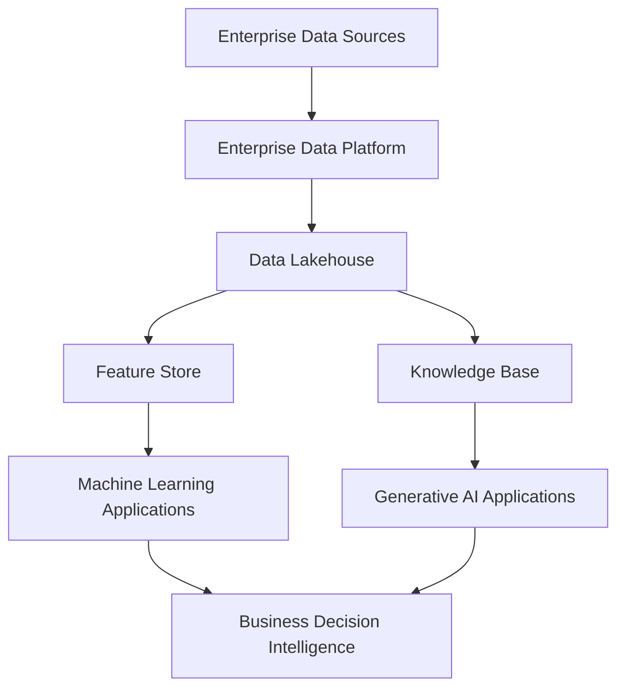
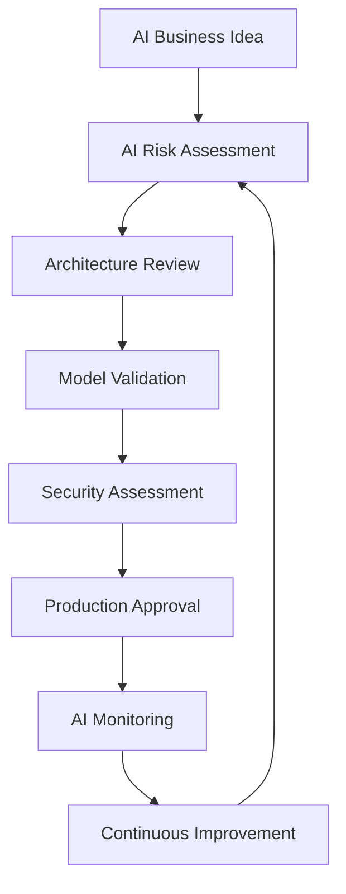
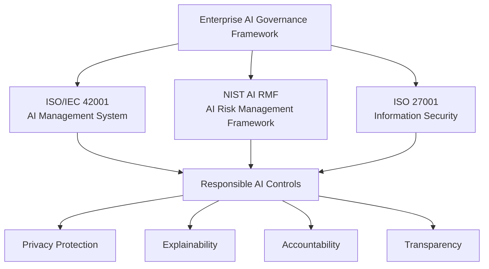
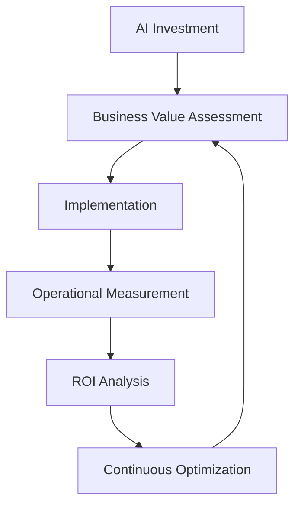
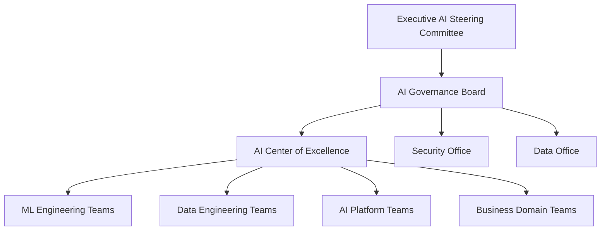
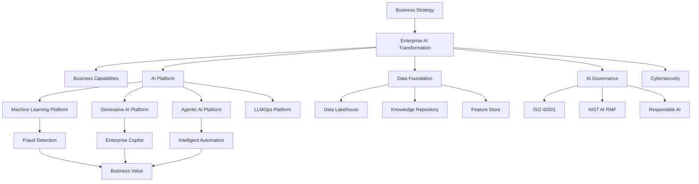
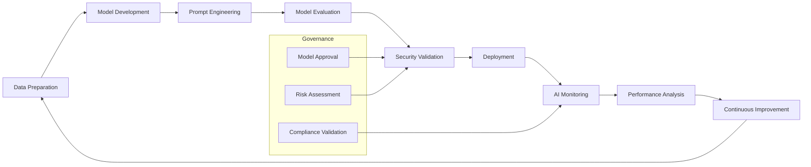
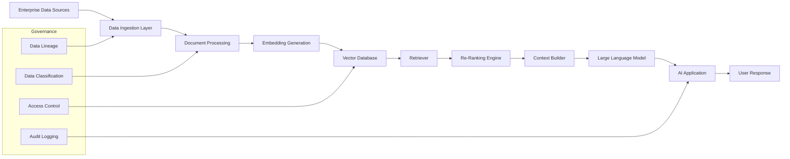
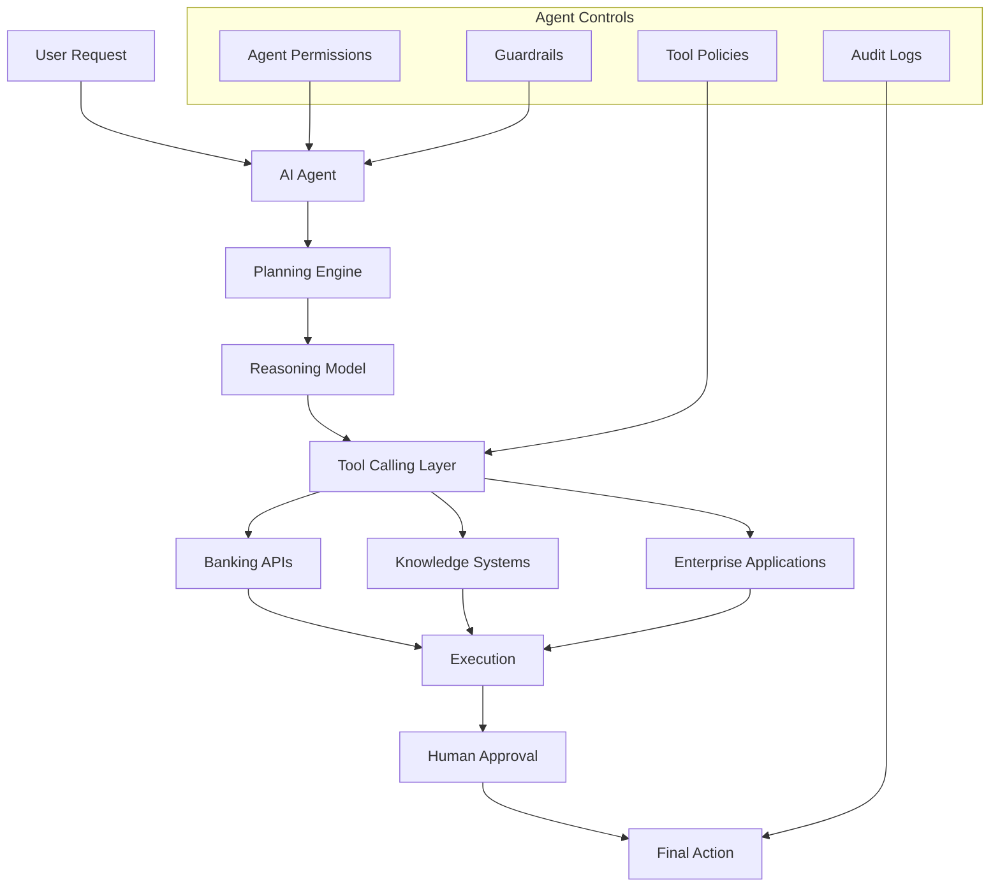

# 🎯 3. Strategic Drivers

## Overview

The **GlobalBank Enterprise AI Transformation Program** is driven by a combination of strategic business objectives, technology modernization initiatives, data capabilities, security requirements, governance principles, regulatory obligations, and operational transformation goals.

These strategic drivers establish the foundation for creating an enterprise-scale Artificial Intelligence capability that enables GlobalBank to transform traditional banking operations into intelligent, predictive, and automated business processes.

The adoption of Enterprise AI represents a strategic evolution from isolated analytical solutions toward a governed AI ecosystem capable of supporting Machine Learning (ML), Generative AI (GenAI), Large Language Models (LLMs), and Agentic AI capabilities.

The transformation will establish a **Secure Enterprise AI Platform** supported by cloud-native architecture, governed enterprise data, AI lifecycle management, responsible AI principles, and strong cybersecurity controls.

---

# 🏦 3.1 Business Drivers

## Business Motivation

GlobalBank operates in a highly competitive and regulated financial ecosystem where transaction volumes, digital interactions, cybersecurity threats, fraud techniques, and customer expectations continue to grow exponentially.

Traditional rule-based systems and fragmented analytical capabilities are no longer sufficient to detect sophisticated financial threats, provide personalized customer experiences, or support real-time business decisions.

Enterprise AI enables GlobalBank to transition from reactive operational models toward predictive, intelligent, and automated decision-making capabilities that improve customer value, operational efficiency, and business agility.

## Key Business Drivers

| Driver | Business Impact |
|---|---|
| Fraud Prevention | Reduce financial losses through intelligent detection and predictive analytics |
| Customer Trust | Improve security, transparency, and confidence in digital banking services |
| Digital Experience | Deliver personalized and intelligent customer interactions |
| Operational Efficiency | Reduce manual activities and optimize business processes |
| Faster Decisions | Enable real-time risk evaluation and business intelligence |
| Employee Productivity | Provide AI copilots and intelligent assistants |
| Market Differentiation | Accelerate innovation and competitive advantage |

---

# ⚙️ 3.2 Technology Drivers

## Technology Motivation

GlobalBank currently operates within a complex technology ecosystem composed of legacy platforms, independent Machine Learning models, disconnected data environments, and inconsistent AI implementation approaches.

These limitations increase operational complexity, reduce scalability, and prevent the organization from rapidly deploying AI capabilities across multiple business domains.

The target architecture requires a modern Enterprise AI Platform based on cloud-native principles, reusable AI services, API-driven integration, automation, event-driven architectures, and enterprise-grade operational resilience.

## Current Technology Challenges

- Legacy fraud detection platforms.
- Independent machine learning solutions.
- Fragmented analytical environments.
- Manual AI deployment processes.
- Limited AI monitoring capabilities.
- Lack of standardized AI lifecycle management.

## Key Technology Drivers

- Establish an Enterprise AI Platform.
- Modernize legacy technology platforms.
- Enable cloud-native AI services.
- Implement API-first architecture.
- Adopt event-driven processing.
- Enable real-time analytics.
- Standardize ML and LLM lifecycle management.
- Implement MLOps and LLMOps capabilities.
- Enable reusable AI components.
- Improve platform resilience and scalability.

---

# 📊 3.3 Data & Information Drivers

## Data Motivation

Enterprise AI depends on trusted, governed, high-quality, and accessible data. Data represents the strategic foundation required to enable predictive analytics, Generative AI solutions, and intelligent autonomous agents.

GlobalBank requires a modern enterprise data foundation capable of integrating structured and unstructured information from multiple business domains while maintaining security, lineage, quality, and regulatory compliance.

The organization must evolve from traditional data platforms toward a governed data ecosystem supporting Data Products, Data Mesh principles, Knowledge Management, and Retrieval-Augmented Generation (RAG) architectures.

## Key Data Drivers

- Establish Enterprise Data Governance.
- Improve enterprise data quality.
- Create trusted data products.
- Enable real-time data availability.
- Implement Data Mesh capabilities.
- Build enterprise knowledge repositories.
- Enable semantic search capabilities.
- Support Retrieval-Augmented Generation (RAG).
- Improve metadata management.
- Establish complete data lineage.

---

## Data Capabilities Required



---

# 🛡️ 3.4 Security & Cyber Risk Drivers

## Security Motivation

Artificial Intelligence introduces new cybersecurity challenges that require security controls beyond traditional application protection mechanisms.

Large Language Models, AI Agents, and Generative AI applications introduce new attack vectors including prompt injection, data leakage, model manipulation, insecure tool execution, and unauthorized autonomous actions.

GlobalBank requires an AI Security by Design approach where security controls are embedded throughout the complete AI lifecycle, from data preparation and model development to deployment and operational monitoring.

## AI Security Challenges

- Prompt Injection.
- Data Leakage.
- Model Manipulation.
- Jailbreaking attacks.
- Tool Abuse.
- Agent Privilege Escalation.
- Sensitive Information Exposure.

## Key Security Drivers

- Implement AI Security by Design.
- Protect sensitive banking information.
- Secure LLM interactions.
- Implement AI threat modeling.
- Apply Zero Trust principles.
- Protect AI APIs.
- Monitor AI behavior.
- Implement AI Guardrails.
- Control AI agent permissions.
- Validate third-party AI providers.

---

## Security Framework Alignment

| Framework | Purpose |
|---|---|
| NIST AI RMF | Artificial Intelligence Risk Management |
| ISO/IEC 42001 | AI Management System Governance |
| OWASP Top 10 for LLM Applications | LLM Security Risks |
| ISO/IEC 27001 | Information Security Management |
| PCI DSS | Payment Data Protection |

---
# 🏛️ 3.5 Governance Drivers

## Governance Motivation

Scaling Artificial Intelligence across a global financial institution requires a strong governance framework that balances innovation, business agility, operational efficiency, and enterprise risk management.

Without proper governance mechanisms, AI adoption may introduce risks related to inaccurate decisions, lack of transparency, regulatory violations, uncontrolled model usage, and inadequate accountability.

GlobalBank must establish an enterprise AI governance model that defines ownership, decision rights, approval processes, lifecycle controls, and accountability across AI solutions, including Machine Learning models, Generative AI applications, Large Language Models, and autonomous AI agents.

## AI Governance Scope

AI governance must provide visibility and control across:

- AI models.
- Training datasets.
- Prompts.
- Retrieval sources.
- AI agents.
- Automated decisions.
- Third-party AI providers.
- AI operational environments.

## Key Governance Drivers

- Establish an AI Governance Board.
- Define AI ownership and accountability.
- Create AI approval lifecycle processes.
- Implement Responsible AI practices.
- Enable model transparency.
- Manage AI risks.
- Maintain audit trails.
- Govern third-party AI services.
- Establish enterprise AI policies.
- Define human oversight mechanisms.

---

## AI Governance Lifecycle



---

# 📜 3.6 Regulatory & Compliance Drivers

## Compliance Motivation

Financial institutions operate under strict regulatory environments where transparency, accountability, privacy protection, and operational resilience are mandatory requirements.

The increasing adoption of Artificial Intelligence requires GlobalBank to ensure that AI solutions comply with regulatory expectations while maintaining explainability, fairness, auditability, and responsible decision-making.

The Enterprise AI Transformation Program must integrate regulatory requirements into architecture standards, development practices, operational processes, and governance controls.

## Key Compliance Drivers

- Meet financial regulatory expectations.
- Support internal and external audits.
- Maintain AI explainability.
- Protect customer privacy.
- Ensure ethical AI adoption.
- Enable regulatory reporting.
- Maintain operational resilience.
- Demonstrate AI accountability.

---

## Regulatory Alignment Framework



---

# 🚀 3.7 Innovation & Competitive Drivers

## Innovation Motivation

Artificial Intelligence represents a strategic capability that enables GlobalBank to differentiate itself in a rapidly changing financial services market.

The adoption of Generative AI, intelligent automation, and autonomous AI agents allows the organization to create new customer experiences, improve employee productivity, and accelerate innovation cycles.

Enterprise AI becomes a business capability that supports continuous innovation while maintaining security, governance, and regulatory compliance.

## Key Innovation Drivers

- Enable Generative AI capabilities.
- Create intelligent banking assistants.
- Deploy AI-powered agents.
- Automate knowledge management.
- Improve financial intelligence.
- Accelerate product innovation.
- Enable ecosystem partnerships.
- Improve customer personalization.
- Support digital transformation initiatives.

---

## Innovation Capability Evolution


---

# 💰 3.8 Financial Drivers

## Financial Motivation

Enterprise AI investments must generate measurable business value while maintaining operational efficiency and cost optimization.

GlobalBank requires a financial management approach that evaluates AI initiatives based on business outcomes, operational improvements, risk reduction, and return on investment.

AI capabilities must be managed as strategic enterprise assets with clear financial accountability.

## Key Financial Drivers

- Reduce operational expenses.
- Increase business automation.
- Optimize infrastructure costs.
- Improve fraud prevention ROI.
- Reduce manual investigation effort.
- Improve employee productivity.
- Establish AI FinOps practices.
- Measure AI business value.
- Optimize AI model consumption costs.

---

## AI Value Management Model



---

# 👥 3.9 Operating Model Drivers

## Operating Model Transformation

Successful AI adoption requires organizational transformation beyond technology implementation.

GlobalBank must establish a collaborative operating model that combines business stakeholders, enterprise architects, data teams, cybersecurity specialists, AI engineers, and governance functions.

The target operating model enables decentralized innovation while maintaining centralized governance, standards, security controls, and enterprise architecture alignment.

## Target Operating Model



---

# 🏗️ Enterprise AI Strategic Architecture

## Strategic Architecture Overview

The Enterprise AI Strategic Architecture defines how business capabilities, AI services, data foundations, and governance controls work together to enable secure and scalable Artificial Intelligence adoption.

This architecture establishes the foundation required to support Machine Learning, Generative AI, Retrieval-Augmented Generation (RAG), and Agentic AI capabilities across GlobalBank.


---

# 🏦 Enterprise AI Capability Map

## Capability Map Introduction

The GlobalBank Enterprise AI Capability Map represents the strategic capabilities required to transform Artificial Intelligence into an enterprise-wide business capability.

The capability model connects business outcomes with AI platforms, data foundations, security controls, and governance mechanisms. It provides a common language between business leaders, architects, engineers, cybersecurity teams, and regulatory stakeholders.

The capability map enables GlobalBank to identify investment priorities, define architecture roadmaps, avoid duplicated solutions, and accelerate AI adoption across different business domains.

---

```mermaid
flowchart LR

%% Business Layer
subgraph Business["🏦 Business AI Capabilities"]

    A1["Fraud Detection<br/>Real-Time Transaction Monitoring"]
    A2["Customer Intelligence<br/>Personalization & Recommendations"]
    A3["Risk Management<br/>Credit & Operational Risk"]
    A4["Operations Automation<br/>Intelligent Workflows"]

end


%% AI Platform Layer
subgraph AI["🤖 Enterprise AI Platform"]

    B1["LLM Gateway<br/>Model Access & Security"]
    B2["RAG Platform<br/>Enterprise Knowledge Retrieval"]
    B3["ML Platform<br/>Predictive Analytics"]
    B4["Agent Framework<br/>Autonomous AI Workflows"]
    B5["Model Registry<br/>Lifecycle Management"]

end


%% Data Layer
subgraph Data["📊 Enterprise Data Foundation"]

    C1["Data Lakehouse<br/>Enterprise Data Platform"]
    C2["Data Governance<br/>Quality & Lineage"]
    C3["Knowledge Base<br/>Vector Database & Documents"]
    C4["Feature Store<br/>ML Feature Management"]

end


%% Governance Layer
subgraph Governance["🛡️ AI Governance & Risk"]

    D1["ISO/IEC 42001<br/>AI Management System"]
    D2["NIST AI RMF<br/>Risk Framework"]
    D3["Responsible AI<br/>Fairness & Explainability"]
    D4["AI Risk Management<br/>Controls & Compliance"]

end


A1 --> B1
A2 --> B2
A3 --> B3
A4 --> B4


B1 --> C3
B2 --> C1
B2 --> C3
B3 --> C4
B4 --> B5


D1 --> B5
D2 --> B5
D3 --> B5
D4 --> B5


C2 --> C1
C2 --> C3
C2 --> C4

---
# 🔐 AI Security Architecture

## Security Architecture Introduction

Enterprise Artificial Intelligence introduces additional security challenges beyond traditional application architectures because AI systems process sensitive information, consume external knowledge sources, interact with enterprise applications, and may execute autonomous actions through intelligent agents.

Unlike traditional applications, AI solutions require protection against new attack vectors such as prompt injection, model manipulation, data leakage, insecure tool execution, jailbreak attacks, and unauthorized agent behavior.

GlobalBank requires an **AI Security Architecture based on Zero Trust principles, Secure-by-Design practices, continuous monitoring, and risk-based security controls**.

The security architecture protects AI models, enterprise data, prompts, agents, APIs, users, and business processes throughout the complete AI lifecycle.

---

## AI Security Principles

| Principle | Description |
|---|---|
| Security by Design | Security controls embedded from AI design phase |
| Zero Trust AI | Continuous verification of users, models, data, and tools |
| Data Protection | Prevent unauthorized access and information leakage |
| Model Security | Protect AI models from manipulation and misuse |
| Responsible AI | Ensure safe, transparent, and ethical AI behavior |
| Continuous Monitoring | Detect abnormal AI behavior and security threats |

---

## AI Security Architecture

```mermaid
flowchart TB

A[Users & Business Applications]

A --> B[API Gateway / AI Gateway]

B --> C[Identity & Access Management]

C --> D[AI Security Layer]


D --> E[Prompt Security]
D --> F[Content Filtering]
D --> G[Data Loss Prevention]
D --> H[AI Guardrails]


H --> I[LLM Models]

I --> J[AI Applications]

J --> K[Monitoring & Observability]

K --> L[AI Security Operations Center]

L --> M[Incident Response]


subgraph Governance Controls

N[AI Risk Management]

O[Security Policies]

P[Audit Logging]

end


N --> D
O --> D
P --> K
```

---

# 🔄 AI Lifecycle & LLMOps Architecture

## LLMOps Introduction

The adoption of Machine Learning, Generative AI, and Large Language Models requires operational capabilities that extend traditional DevOps and MLOps practices.

LLMOps introduces processes, automation, governance controls, and operational capabilities required to manage AI solutions throughout their lifecycle, including development, validation, deployment, monitoring, security assessment, and continuous optimization.

GlobalBank requires an enterprise LLMOps capability to guarantee reliability, scalability, regulatory compliance, operational visibility, and continuous improvement of AI solutions.

---

## LLMOps Lifecycle Capabilities

| Capability | Description |
|---|---|
| Data Management | Preparation and validation of AI datasets |
| Model Management | Versioning and lifecycle control |
| Prompt Management | Prompt engineering and governance |
| Evaluation Framework | Quality, accuracy, and safety validation |
| Deployment Automation | CI/CD pipelines for AI workloads |
| Monitoring | Performance and behavior tracking |
| Governance | Approval workflows and auditability |

---

## Enterprise LLMOps Lifecycle



---

# 📚 Enterprise RAG Architecture

## RAG Architecture Introduction

Retrieval-Augmented Generation (RAG) enables GlobalBank to combine Large Language Models with enterprise knowledge repositories while maintaining control over information sources, access permissions, and data governance requirements.

Instead of depending exclusively on model training data, RAG retrieves relevant enterprise information from trusted repositories and provides contextual knowledge to AI applications during inference.

This approach improves response accuracy, reduces hallucination risks, increases explainability, and enables secure AI adoption for regulated banking scenarios.

---

## RAG Business Capabilities

| Capability | Business Value |
|---|---|
| Enterprise Search | Faster access to institutional knowledge |
| Document Intelligence | Automated analysis of business documents |
| Customer Support AI | Improved customer service responses |
| Compliance Assistance | Faster regulatory analysis |
| Employee Copilots | Increased workforce productivity |

---

## Enterprise RAG Architecture



---

# 🤖 Agentic AI Architecture

## Agentic AI Introduction

Agentic AI extends Generative AI capabilities by enabling autonomous agents capable of planning, reasoning, executing tasks, and interacting with enterprise systems.

For financial institutions, AI agents can support complex business processes such as customer service automation, investigation assistance, compliance analysis, financial operations, and intelligent workflow execution.

GlobalBank must implement strong agent governance mechanisms to control permissions, available tools, autonomous actions, decision boundaries, and mandatory human approval processes.

---

## Agent Governance Requirements

| Control Area | Objective |
|---|---|
| Agent Identity | Define ownership and accountability |
| Tool Permissions | Control available enterprise actions |
| Human Approval | Maintain oversight for critical decisions |
| Auditability | Track agent decisions and activities |
| Security Policies | Prevent unauthorized behavior |

---

## Agentic AI Architecture



---

# 🎯 Strategic Outcome

## Enterprise AI Transformation Vision

The **GlobalBank Enterprise AI Transformation Program** establishes Artificial Intelligence as a strategic enterprise capability rather than an isolated technology initiative.

The program integrates business transformation, secure technology modernization, trusted data foundations, AI governance, cybersecurity controls, and operational excellence to create a sustainable foundation for responsible AI adoption.

---

## Expected Strategic Outcomes

| Strategic Area | Expected Outcome |
|---|---|
| Business Value | Improved customer experience and operational efficiency |
| Risk Management | Reduced fraud and improved decision accuracy |
| Technology | Scalable enterprise AI platform capabilities |
| Data | Trusted and governed AI-ready information ecosystem |
| Security | Secure AI adoption with enterprise controls |
| Governance | Responsible and compliant AI lifecycle management |
| Innovation | Faster delivery of AI-powered financial services |

---

# 🌎 Final Vision

GlobalBank will evolve into an **AI-enabled financial institution** capable of delivering:

- Secure intelligent banking experiences.
- Real-time risk and fraud prevention.
- Personalized customer interactions.
- AI-powered employee productivity.
- Autonomous operational capabilities.
- Responsible and compliant AI innovation.

The Enterprise AI Transformation Program establishes the foundation for:

- Sustainable business growth.
- Digital leadership.
- Operational resilience.
- Regulatory confidence.
- Competitive advantage in the future financial ecosystem.
